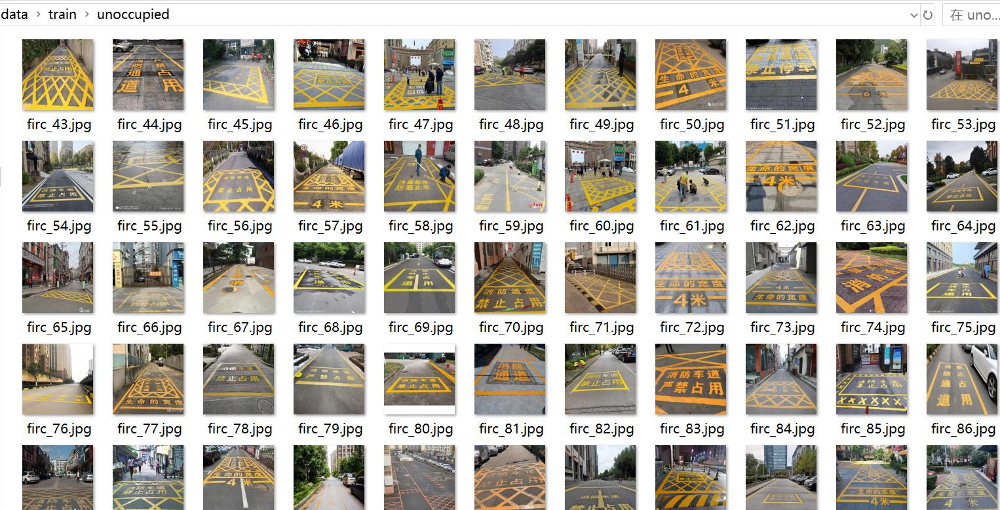
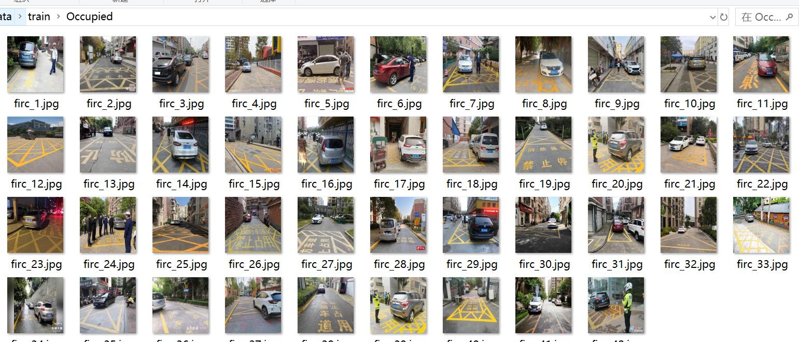
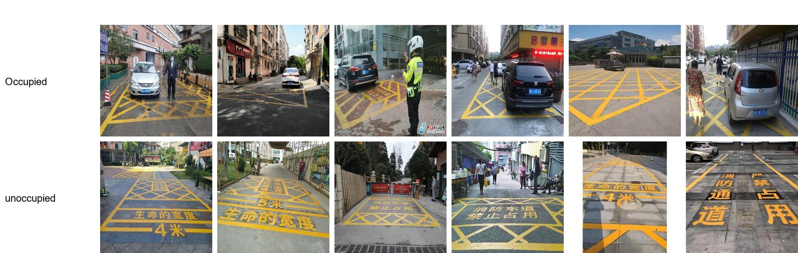

# Traffic Obstruction Dataset with 216 Images in Two Categories

Dataset Type: Image Classification Dataset
Not suitable for Object Detection without labeled files.
Dataset Format: Only contains jpg images, each category folder contains corresponding images.
Number of Images (jpg file count): 216
Number of Categories: 2
Category Names: ['Occupied', 'unoccupied']
Image Count per Category:  
Training Set Images: 184
- Occupied Training Set Images: 42
- Unoccupied Training Set Images: 142
Validation Set Images: 32
- Occupied Validation Set Images: 25
- Unoccupied Validation Set Images: 7
Test Set Images: 0
Total Images:  
- Occupied Total Images: 67
- Unoccupied Total Images: 149
Important Note: No specific details provided.
Special Disclaimer: This dataset does not guarantee the accuracy of the trained model or weight files.
Preview of Images:

Here is a pay link on Stripe ( https://buy.stripe.com/3cs8yP7sY87d0vu9AB ). Please contact me lonlonago@foxmail.com after funding $89, and I will send you a complete data files , thank you!

